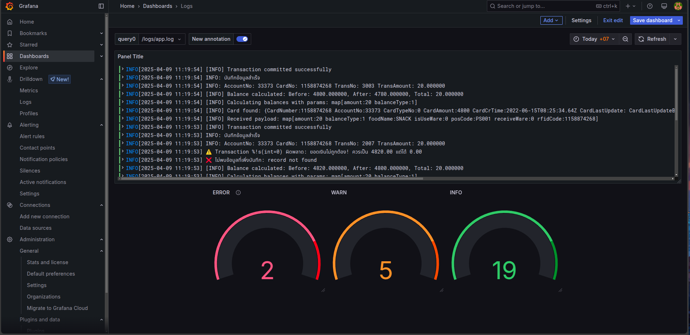

# Docker Logs with Loki, Grafana, and Promtail

This project demonstrates how to set up a centralized logging system using Docker, Loki, Grafana, and Promtail.

## Components

*   **Loki:** A horizontally-scalable, highly-available, multi-tenant log aggregation system inspired by Prometheus.
*   **Grafana:** An open-source platform for monitoring and observability. It's used here to visualize logs stored in Loki.
*   **Promtail:** An agent that ships the contents of local logs to Loki.

## Setup

1.  **Prerequisites:**
    *   Docker
    *   Docker Compose

2.  **Configuration:**
    *   `docker-compose.yml`: Defines the services (Loki, Promtail, Grafana) and their configurations.
    *   `loki-config.yml`: Configuration file for Loki.
    *   `promtail-config.yml`: Configuration file for Promtail, specifying how to scrape logs and send them to Loki.
    * `logs`: folder for logs.

3.  **Running the Stack:**
    ```bash
    docker-compose up -d

4. ** Access Grafana:**
    *   Open your browser and go to `http://localhost:3000`
    *   Default credentials:
        *   Username: `admin`
        *   Password: `admin`
    *   Change the password when prompted.

    

5.  **Add Loki as a Data Source in Grafana:**
    *   Go to `Configuration` > `Data Sources` > `Add data source`.
    *   Select `Loki`.
    *   Set the URL to `http://loki:3100`.
    *   Click `Save & Test`.

    

6.  **Explore Logs:**
    *   Go to `Explore` in Grafana.
    *   Select `Loki` as the data source.
    *   You can now query and visualize logs from your Docker containers.
7.  **View Logs:**
    *   Open your browser and go to `http://localhost:3100`.
    *   You can view logs directly from the Loki web interface.

    


8.  **Stop the Stack:**
    ```bash
    docker-compose down
    ```
## Notes

* สร้างไฟล์ `docker-compose.yml` และ `loki-config.yml` และ `promtail-config.yml` ในโฟลเดอร์เดียวกัน
* สร้างโฟลเดอร์ `logs` ในโฟลเดอร์เดียวกัน
* สร้างโฟลเดอร์ `loki-data` ในโฟลเดอร์เดียวกัน
* service ที่ต้องการให้ log ไปที่ Loki ในโฟลเดอร์เดียวกัน

    